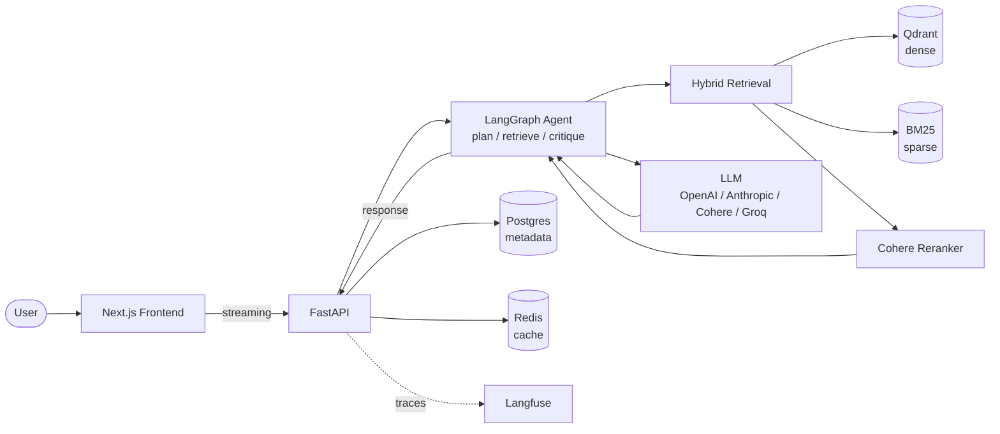

# finsight

> Agentic RAG for financial analysis — production-grade retrieval over SEC filings and earnings calls.

[](https://github.com/himanshu-kr7/finsight/actions/workflows/ci-api.yml)
[](LICENSE)
[](https://www.python.org/downloads/)
[](https://github.com/astral-sh/ruff)
[](http://mypy-lang.org/)

**finsight** is an in-development RAG system that answers complex, multi-document questions about public companies by reasoning over their SEC filings (10-K, 10-Q), earnings call transcripts, and press releases. The corpus covers 10 large-cap companies across 5 fiscal years and 4 document types — roughly 650 documents and tens of millions of tokens.

It is the v2 follow-up to an earlier research project, [IITP_RAG_project](https://github.com/himanshu-kr7/IITP_RAG_project), which hit 94.7% answer relevancy on the RAGAs evaluation framework — reimagined here with modern retrieval, agentic reasoning, and full production engineering.

---

## Status

> **Phase 1 of 6 — Foundation.** The application skeleton, infrastructure, and CI are live. Retrieval, ingestion, agentic logic, and the frontend are scheduled for subsequent phases. See the [Roadmap](#roadmap).

---

## Why this exists

The original [IITP_RAG_project](https://github.com/himanshu-kr7/IITP_RAG_project) was a single-document RAG built during my MTech at IIT Patna. Its final version (V1.3) hit 94.7% answer relevancy on RAGAs — strong numbers for a notebook-driven research artifact.

**finsight** is the production-engineering follow-up. The research questions shift:

| | V1 (IITP_RAG_project) | V2 (finsight) |
|---|---|---|
| **Scope** | Single document, single question | Multi-document, multi-company, cross-year |
| **Retrieval** | BM25 + FAISS + Cohere reranker | Hybrid dense+sparse, contextual chunking, semantic + parent-doc retrieval |
| **Reasoning** | Single-shot retrieve → generate | LangGraph agent: plan → retrieve → critique → refine |
| **Eval** | RAGAs notebook | RAGAs + custom rubrics + Langfuse traces + regression suite |
| **Deployment** | Local notebook | Dockerized FastAPI + Next.js, observability, CI/CD |

The goal isn't bigger benchmark numbers. It's whether a real RAG system survives contact with real production constraints.

---

## Target architecture



Most of this is scaffolded but not yet wired. See the roadmap for what lands when.

---

## Quickstart

Requirements: [Docker](https://docs.docker.com/engine/install/), [uv](https://docs.astral.sh/uv/), and `make`.

```bash
git clone git@github.com:himanshu-kr7/finsight.git
cd finsight
cp .env.example .env       # fill in API keys for any LLM providers you have
make dev                   # bring up the full stack (api + qdrant + postgres + redis)
```

Verify it's running:

```bash
make ps                                           # all containers should be (healthy)
curl http://localhost:8000/health/ready           # {"status":"ready",...}
```

Open in browser:
- **API docs (Swagger):** http://localhost:8000/docs
- **Qdrant dashboard:** http://localhost:6333/dashboard

Stop when done:

```bash
make down
```

---

## Tech stack

| Layer | Choice |
|---|---|
| Language | Python 3.12 |
| Package mgmt | [uv](https://docs.astral.sh/uv/) |
| API | FastAPI + Uvicorn |
| Config | Pydantic Settings v2 (strict, typed) |
| Logging | structlog (console + JSON renderers) |
| Type checking | `mypy --strict` |
| Linting / formatting | ruff |
| Testing | pytest + pytest-asyncio + coverage |
| Vector DB | Qdrant |
| Metadata DB | PostgreSQL 17 |
| Cache | Redis 7 |
| Observability | Langfuse (self-hosted) + OpenTelemetry _(Phase 4)_ |
| Orchestration | LangGraph _(Phase 3)_ |
| Frontend | Next.js 15 + TypeScript + Tailwind + shadcn/ui _(Phase 2)_ |
| Containers | Docker + Docker Compose |
| CI/CD | GitHub Actions |
| Pre-commit | ruff, mypy, gitleaks, conventional commits |

LLM providers are multi-vendor by design — OpenAI, Anthropic, Cohere, Groq, Together — selected by environment variable.

---

## Roadmap

- [x] **Phase 1 — Foundation.** Monorepo, FastAPI skeleton, Pydantic config, structlog, pytest, `mypy --strict`, ruff, dockerized stack (api + qdrant + postgres + redis), pre-commit hooks, GitHub Actions CI, Makefile.
- [ ] **Phase 2 — Modern retrieval stack.** SEC EDGAR fetcher, Docling/LlamaParse for filings, contextual + parent-doc retrieval, semantic chunking, hybrid (dense + sparse) search, embedding-model comparison. Next.js frontend scaffold.
- [ ] **Phase 3 — Advanced RAG.** LangGraph agent (plan/retrieve/critique/refine), HyDE, GraphRAG over filing entities, multi-modal (tables and figures).
- [ ] **Phase 4 — Production engineering.** OpenTelemetry traces, JWT auth, rate limiting, async background jobs, Helm charts.
- [ ] **Phase 5 — Evaluation rigor.** RAGAs + custom rubrics, regression suite over a curated eval set, drift monitoring, A/B framework.
- [ ] **Phase 6 — Polish & deploy.** Frontend live on `finsight.<domain>`, full docs pass, demo video.

---

## Project structure
finsight/
├── apps/
│   ├── api/                       # FastAPI backend
│   │   ├── src/finsight/
│   │   │   ├── api/               # routes + app factory
│   │   │   ├── agents/            # LangGraph agents (Phase 3)
│   │   │   ├── evaluation/        # RAGAs harness (Phase 5)
│   │   │   ├── generation/        # LLM prompting and synthesis
│   │   │   ├── ingestion/         # SEC fetcher, parsing, chunking (Phase 2)
│   │   │   ├── observability/
│   │   │   ├── retrieval/         # Hybrid search, reranking (Phase 2)
│   │   │   ├── config.py
│   │   │   └── logging.py
│   │   ├── tests/                 # unit + integration
│   │   ├── Dockerfile
│   │   └── pyproject.toml
│   └── web/                       # Next.js frontend (Phase 2)
├── data/                          # corpus + processed artifacts (gitignored)
├── docs/                          # architecture docs + ADRs
├── notebooks/                     # ad-hoc analysis
├── .github/workflows/             # CI
├── docker-compose.yml
├── Makefile
└── README.md

---

## Development

All common commands are wrapped in `make`:

| Command | What it does |
|---|---|
| `make dev` | Start the full stack |
| `make down` | Stop the stack |
| `make api-local` | Run API outside Docker with auto-reload |
| `make test` | Run pytest with coverage |
| `make lint` | Run ruff |
| `make typecheck` | Run `mypy --strict` |
| `make check` | Lint + typecheck + test (full quality gate, same as CI) |
| `make logs` | Tail logs from all services |
| `make help` | Full list with descriptions |

Pre-commit hooks (ruff, mypy, gitleaks, conventional commits) run on every commit. Install them once:

```bash
make install
make precommit-install
```

---

## Documentation

- [Architecture overview](docs/architecture.md) _(in progress)_
- [ADR 0001 — initial architecture decisions](docs/decisions/0001-architecture.md) _(in progress)_

---

## Disclaimer

finsight is a research and engineering portfolio project. It is not financial advice. Outputs may be inaccurate or out of date and should not be used as the basis for investment decisions.

---

## License

[MIT](LICENSE) — Himanshu Kumar.

---

## Author

Built by **Himanshu Kumar** ([@himanshu-kr7](https://github.com/himanshu-kr7)) — MTech,Artificial Intelligence,  IIT Patna.
